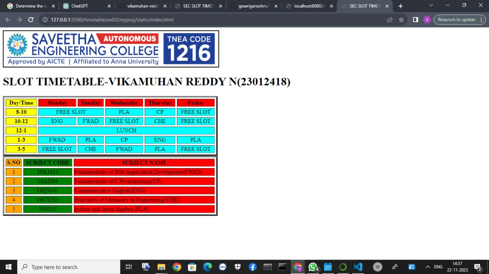

# Experiment_Time_Table

## AIM
To Write a html webpage page to display your timetable.

# ALGORITHM
### STEP 1
create a simple table using table tag
### STEP 2
Add header row using th tag
### STEP 3
Add your timetable
### STEP 4
Execute the program

# CODE
```html
 
<title>SEC SLOT TIMETABLE</title>
<BODY>
	
</BODY>

<table>
    <table border="4" width="600" cellspacing='4' cellpaddling='4'>

<h1>SLOT TIMETABLE-VIKAMUHAN REDDY N(23012418)</h1>
<tr>
    <th align="center" bgcolor="yellow">Day/Time</th>
    <th align="center" bgcolor="red">Monday</th>
    <th align="center" bgcolor="red">Tuesday</th>
    <th align="center" bgcolor="red">Wednesday</th>
    <th align="center" bgcolor="red">Thursday</th>
    <th align="center" bgcolor="red">Friday</th>
</tr>
<tr>
    
    <th align="center" bgcolor="yellow">8-10</th>
    <td align="center" bgcolor="cyan" colspan="2">FREE SLOT</td>
    <td align="center" bgcolor="cyan">PLA</td>
    <td align="center" bgcolor="cyan">CP</td>
    <td align="center" bgcolor="cyan" colspan="2">FREE SLOT</td>
</tr>

<tr>
    
    <th align="center" bgcolor="yellow">10-12</th>
    <td align="center" bgcolor="cyan">ENG</td>
    <td align="center" bgcolor="cyan">FWAD</td>
    <td align="center" bgcolor="cyan">FREE SLOT</td>
    <td align="center" bgcolor="cyan">CHE</td>
    <td align="center" bgcolor="cyan" colspan="2">FREE SLOT</td>
</tr>
<tr>
    
    <th align="center" bgcolor="yellow">12-1</th>
    <td align="center" bgcolor="cyan" colspan="5">LUNCH</td>
</tr>

<tr>
   
    <th align="center" bgcolor="yellow">1-3</th>
    <td align="center" bgcolor="cyan">FWAD</td>
    <td align="center" bgcolor="cyan">PLA</td>
    <td align="center" bgcolor="cyan">CP</td>
    <td align="center" bgcolor="cyan">ENG</td>
    <td align="center" bgcolor="cyan">PLA</td>
</tr>

<tr>
    <th align="center" bgcolor="yellow">3-5</th>
    <td align="center" bgcolor="cyan">FREE SLOT</td>
    <td align="center" bgcolor="cyan">CHE</td>
    <td align="center" bgcolor="cyan">FWAD</td>
    <td align="center" bgcolor="cyan">PLA</td>
    <td align="center" bgcolor="cyan">FREE SLOT</td>
</tr>
</table>

<table border="4" width="600" cellspacing='4' cellpaddling='4'>

<tr>
    <th align="center" bgcolor="orange">S.NO</th>
    <th align="center" bgcolor="green" >SUBJECT CODE</th> 
    <th align="center" bgcolor="red">SUBJECT NAME</th>
    
</tr>

<tr>
    <td align="center" bgcolor="orange">1</td>
    <td align="center" bgcolor="green">19A1414</td>
    <td align="centre"  bgcolor="red" >Fundamentals of Web Application Devlopment(FWAD)</td>
</tr>

<tr>
    <td align="center" bgcolor="orange">2</td>
    <td align="center" bgcolor="green">19AI304</td>
    <td align="centre"  bgcolor="red" >Fundamentals of C Programming(CP)</td>
</tr>

<tr>
    <td align="center" bgcolor="orange">3</td>
    <td align="center" bgcolor="green">19EN101</td>
    <td align="centre"  bgcolor="red" >Communicative English(ENG)</td>
</tr>

<tr>
    <td align="center" bgcolor="orange">4</td> 
    <td align="center" bgcolor="green">19CY205</td>
    <td align="centre"  bgcolor="red" >Principles of Chemistry in Engineering(CHE)</td>
</tr>

<tr>
    <td align="center" bgcolor="orange">5</td>
    <td align="center" bgcolor="green">19301C</td>
    <td align="centre" bgcolor="red" >python and linear algebra (PLA)</td>
</tr>
</table>

```


# OUTPUT
